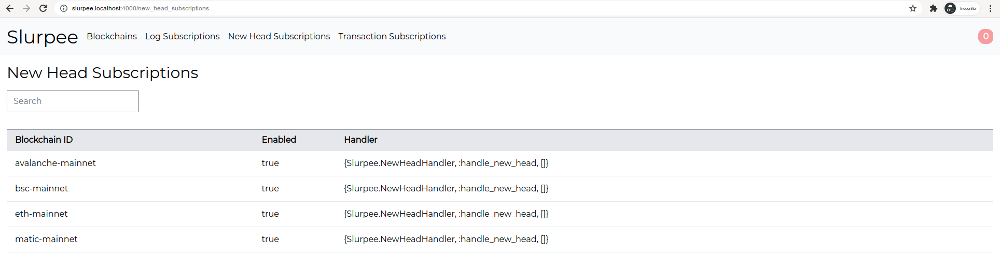

# Slurpee
[](https://github.com/fremantle-industries/slurpee/actions?query=workflow%3Atest)
[](https://coveralls.io/github/fremantle-industries/slurpee?branch=main)
[](https://hex.pm/packages/slurpee)

A GUI frontend to manage blockchain ingestion with [`slurp`](https://github.com/fremantle-industries/slurp)

[Built with Slurpee](./docs/BUILT_WITH_SLURPEE.md) | [Install](#install)





## Install

Add `slurpee` to your list of dependencies in `mix.exs`

```elixir
def deps do
  [
    {:slurpee, "~> 0.0.18"}
  ]
end
```

## Running slurpee as a standalone endpoint

Add the slurpee phoenix endpoint to your config

```elixir
config :slurpee, SlurpeeWeb.Endpoint,
  http: [port: 4000],
  url: [host: "slurpee.localhost", port: "4000"],
```

## Embedding slurpee in your own Elixir project

There are two options for running `slurpee` along side your existing Elixir projects

1. Plug & Phoenix provide the ability to host multiple endpoints
as servers on different ports

```elixir
# config/config.exs
# Phoenix endpoints
config :my_app, MyAppWeb.Endpoint,
  pubsub_server: MyApp.PubSub,
  http: [port: 4000],
  url: [host: "my-app.localhost", port: "4000"],
  live_view: [signing_salt: "aolmUusQ6//zaa5GZHu7DG2V3YAgOoP/"],
  secret_key_base: "vKt36v4Gi2Orw8b8iBRg6ZFdzXKLvcRYkk1AaMLYX0+ry7k5XaJXd/LY/itmoxPP",
  server: true

config :slurpee, SlurpeeWeb.Endpoint,
  pubsub_server: Slurpee.PubSub,
  http: [port: 4001],
  url: [host: "slurpee.localhost", port: "4001"],
  live_view: [signing_salt: "aolmUusQ6//zaa5GZHu7DG2V3YAgOoP/"],
  secret_key_base: "xKt36v4Gi2Orw8b8iBRg6ZFdzXKLvcRYkk1AaMLYX0+ry7k5XaJXd/LY/itmoxPP",
  server: true
```

2. Use a proxy to host multiple endpoints on the same port [https://github.com/jesseshieh/master_proxy](https://github.com/jesseshieh/master_proxy)

```elixir
# mix.exs
def deps do
  [
    {:master_proxy, "~> 0.1"}
  ]
end
```

```elixir
# config/config.exs
# Phoenix endpoints
config :niex, MyAppWeb.Endpoint,
  pubsub_server: MyApp.PubSub,
  live_view: [signing_salt: "aolmUusQ6//zaa5GZHu7DG2V3YAgOoP/"],
  secret_key_base: "vKt36v4Gi2Orw8b8iBRg6ZFdzXKLvcRYkk1AaMLYX0+ry7k5XaJXd/LY/itmoxPP",
  server: false,
  debug_errors: true,
  check_origin: false

config :slurpee, SlurpeeWeb.Endpoint,
  pubsub_server: Slurpee.PubSub,
  live_view: [signing_salt: "polmUusQ6//zaa5GZHu7DG2V3YAgOoP/"],
  secret_key_base: "xKt36v4Gi2Orw8b8iBRg6ZFdzXKLvcRYkk1AaMLYX0+ry7k5XaJXd/LY/itmoxPP",
  server: false,
  debug_errors: true,
  check_origin: false


# Master Proxy
config :master_proxy,
  # any Cowboy options are allowed
  http: [:inet6, port: 4000],
  # https: [:inet6, port: 4443],
  backends: [
    %{
      host: ~r/my-app.localhost/,
      phoenix_endpoint: MyAppWeb.Endpoint
    },
    %{
      host: ~r/slurpee.localhost/,
      phoenix_endpoint: SlurpeeWeb.Endpoint
    }
  ]
```

## Development

You can run the app natively on the host

```bash
$ mix setup
$ mix phx.server
```

Or within `docker-compose`

```
$ docker-compose up
```

Wait a few seconds for the app to boot and you should be able to view the app at `http://slurpee.localhost:4000`

## Test

```bash
$ mix test
```

## Help Wanted :)

If you think this `slurpee` thing might be worthwhile and you don't see a feature
we would love your contributions to add them! Feel free to drop us an email or open
a Github issue.

## Authors

* [Alex Kwiatkowski](https://github.com/rupurt) - alex+git@fremantle.io

## License

`slurpee` is released under the [MIT license](./LICENSE.md)
